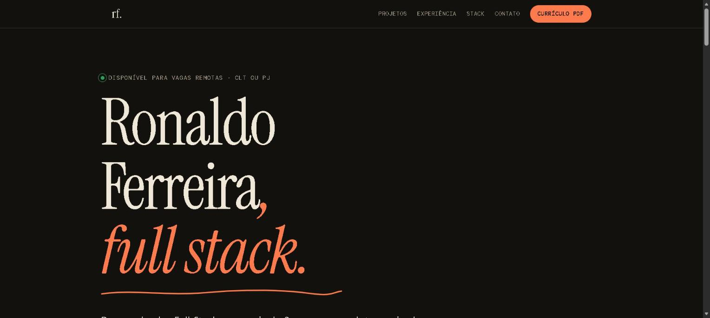

# Portfólio

Meu portfólio, feito para quem contrata: o que eu entrego, os projetos em que trabalhei, a experiência e como falar comigo.

No ar em https://ronaldo-ferreira-dev.vercel.app



## O que tem aqui

É um site estático de um arquivo só. Sem build e sem framework. As animações usam [Anime.js](https://animejs.com) carregado por CDN, e o layout respeita `prefers-reduced-motion` e o modo escuro do sistema.

```
index.html                       página inteira (HTML, CSS e JS)
og-image.png                     imagem de pré-visualização para links
curriculo-ronaldo-ferreira.pdf   currículo em PDF
```

## Rodar localmente

Qualquer servidor de arquivos estáticos serve:

```bash
python -m http.server 8765
```

Depois abra http://localhost:8765.

## Publicar

Eu publico na Vercel, direto da pasta:

```bash
npx vercel deploy --prod
```

Os projetos de empresas e clientes que aparecem na página são privados, por isso o código deles não está em nenhum repositório público.
